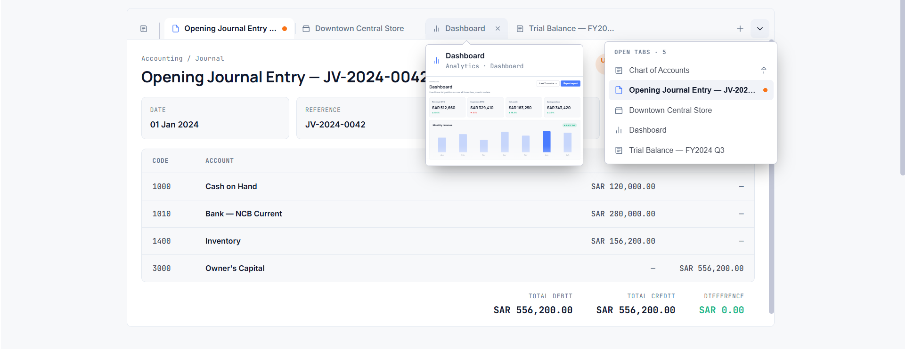
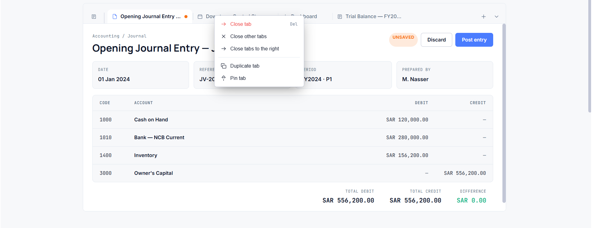
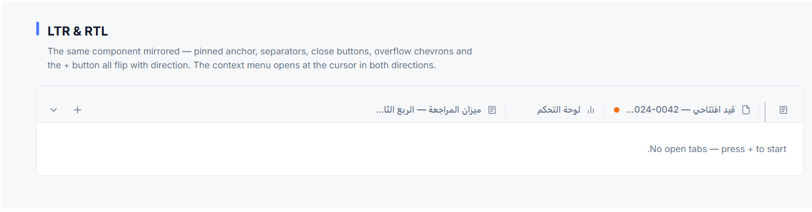
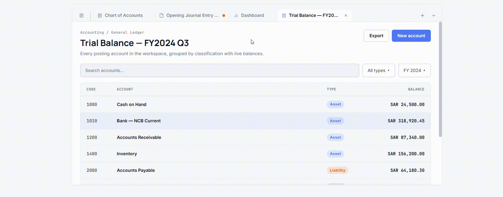

# GeniusLink Design System

A Flutter design-system package for browser-style workspace tabs, themed
previews, contextual menus, dirty-state guards, and RTL-ready navigation.

It is prepared in the same layout and documentation style expected by pub.dev
packages, including package metadata, example documentation, changelog, license,
and public API comments.

## Features

- Browser-style tab strip with active, inactive, hover, pressed, and focused
  states.
- Pinned tabs, closable tabs, dirty-state indicators, and guarded dirty-close
  confirmation.
- Right-click and long-press context menu with close, close others, close to
  the right, duplicate, and pin or unpin actions.
- Overflow chevrons plus a tab-list dropdown for jumping to any open tab.
- Hover-intent mini-page previews that render a scaled version of the real tab
  page.
- Drag-to-reorder, keyboard navigation, dark and light themes, and RTL layout.
- Self-contained theme tokens through `BrowserStyleTabBarThemeData`.

## Feature Snapshots

### Browser-Style Workspace Tabs

The tab strip mirrors a modern browser workspace: active tabs merge into the
content surface, inactive tabs stay compact, and the add-tab and tab-list
buttons stay anchored at the trailing edge.



### Pinned, Closable, and Dirty Tabs

Pinned tabs stay at the leading edge, closable tabs expose close affordances on
hover or active state, and dirty tabs show an unsaved indicator before the user
attempts to close them.


### Context Menu Actions

Right-click and long-press open a tab context menu with close, close others,
close to the right, duplicate, and pin or unpin actions, including disabled and
danger states.



### Overflow and Tab-List Dropdown

Overflow chevrons appear only when the strip scrolls horizontally. The tab-list
dropdown lists every open tab, highlights the active tab, and marks pinned or
dirty tabs so users can jump directly to the right workspace.


### Hover-Intent Mini-Page Preview

Hovering over a tab opens a mini-page preview after a short delay. The preview
renders a scaled version of the real page instead of a placeholder skeleton.


### Drag, Keyboard, Theme, and RTL Support

The component supports drag-to-reorder, Left/Right/Home/End keyboard navigation,
dark and light themes, and mirrored RTL layout for tab placement, separators,
overflow controls, and menus.



### Interactive Preview

The included GIF shows the same interactions in motion, including tab
selection, menus, previews, and overflow behavior.



### Self-Contained Theme Tokens

`BrowserStyleTabBarThemeData` carries all component tokens, including surfaces,
foreground colors, semantic colors, radii, shadows, font family names, and
motion values, so the tab strip and its overlays can be themed without a global
design-system dependency.


## Getting Started

Add the package to a Flutter app. For the current local checkout, use a path
dependency:

```yaml
dependencies:
  geniuslink_design_system:
    path: ../flutter
```

Then import the public barrel:

```dart
import 'package:geniuslink_design_system/geniuslink_design_system.dart';
```

Register the theme extension on your app theme:

```dart
ThemeData(
  useMaterial3: true,
  extensions: const [
    BrowserStyleTabBarThemeData.dark,
  ],
);
```

Use `BrowserStyleTabBarThemeData.light` for light mode, or switch between both
with `ThemeMode`.

## Usage

Create a tab strip with the built-in sample state:

```dart
const BrowserStyleTabBar();
```

Seed it with your own tabs:

```dart
BrowserStyleTabBar(
  tabsState: [
    BrowserTab(
      id: 1,
      title: 'Chart of Accounts',
      kind: GLTabKind.ledger,
      pinned: true,
    ),
    BrowserTab(
      id: 2,
      title: 'Opening Journal Entry',
      kind: GLTabKind.doc,
      dirty: true,
    ),
    BrowserTab(
      id: 3,
      title: 'Dashboard',
      kind: GLTabKind.chart,
    ),
  ],
);
```

Render a content page for a single tab when you need the same demo surface
outside the tab strip:

```dart
GLTabPage(
  tab: BrowserTab(
    id: 4,
    title: 'Downtown Central Store',
    kind: GLTabKind.store,
  ),
);
```

## Theming

`BrowserStyleTabBarThemeData` is a `ThemeExtension` that contains the colors,
font family names, radii, elevation shadows, and motion tokens used by the tab
strip and its overlays.

```dart
final tabsTheme = BrowserStyleTabBarThemeData.of(context);
```

If no extension is registered, `BrowserStyleTabBarThemeData.of(context)` falls
back to the dark preset so the widget can still paint.

The package references these optional font families:

- `Manrope` for display text.
- `Inter` for body text.
- `JetBrainsMono` for tab metadata and numeric text.

If your app does not register those fonts, Flutter falls back to the platform
font. The example keeps the font declarations commented in `pubspec.yaml` so
you can add the `.ttf` files when available.

## Example

Run the included example app:

```bash
cd example
flutter pub get
flutter run -d chrome
```

The example opens a product-like workspace shell with a left navigation rail,
window chrome, the browser tab strip, a dark and light toggle, an RTL specimen,
and a documentation gallery.

## Public API

The primary import is:

```dart
import 'package:geniuslink_design_system/geniuslink_design_system.dart';
```

It exports:

- `BrowserStyleTabBar`
- `BrowserStyleTabBarThemeData`
- `BrowserTab`
- `GLTabKind`
- `GLTabPage`
- `glTabIcon`
- `glPreviewMeta`
- `kNewTabCycle`

The tab strip owns its internal tab list and active-tab state after creation.
To lift state into an application controller, keep the public model shape and
move the operations from the widget state into your own controller layer.

## Accessibility and Interaction

- Mouse: hover, close, context menu, drag-to-reorder, and preview-on-hover.
- Touch: tap, long-press context menu, and scrollable overflow.
- Keyboard: Left, Right, Home, End, and Escape for overlay dismissal.
- Directionality: all tab edges, paddings, menus, and dropdown placement honor
  `Directionality`.

## Platform Support

The package uses Flutter framework widgets only and has no native plugin code.
It is suitable for Android, iOS, Linux, macOS, web, and Windows, with the most
complete browser-tab interaction model on desktop and web.

## Publishing Checklist

Before publishing this package publicly, verify the final release metadata:

- Replace the private `LICENSE` file if the package should be distributed under
  an open-source license.
- Run `flutter analyze` and `dart pub publish --dry-run` from the package root.

## License

See `LICENSE` for the current redistribution terms.
